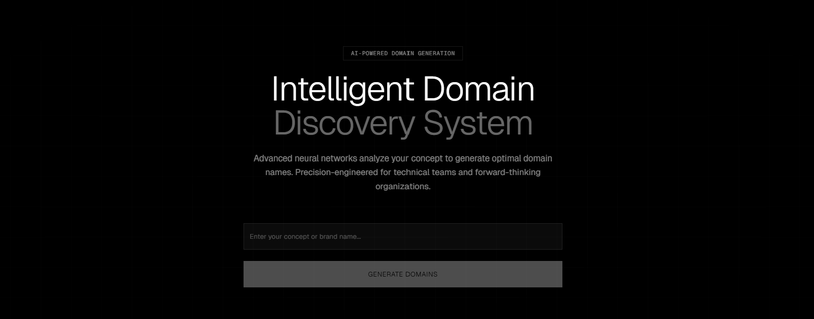
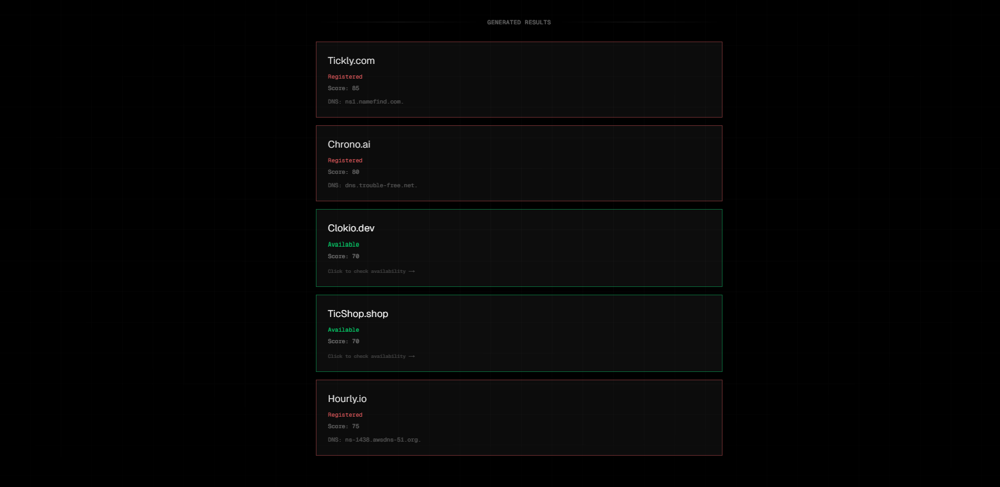

# DomainFlux

A lightning-fast domain name discovery engine built for founders, makers, and anyone launching something new.  
Search, filter, and validate brand-worthy domains in seconds.

## 🚀 Features
- 🔍 Instant domain availability checks  
- ⚡ Fast search with clean UI  
- 📋 Smart filters for picking better names  
- 🌐 Links to purchase/register  
- 📱 Fully responsive

## 🧠 Why I Built This
I am always looking for nie domains to buy and later use on the thousands of project ideas that I have.
But coming up with domain names shouldn’t slow down founders.  
DomainFlux helped me move fast and build without friction.

## 🛠 Tech Stack
- Next.js  
- Tailwind CSS  
- Domain API (Custom Endpoint)  
- Shadcn components
- Vercel Deployment

## 📸 Screenshots

## 🧪 Future Improvements
- Add favorite lists  
- Integrate multiple registrars
- Increase info provided for each domain
- Allow differents TLD

## 🔗 Live Demo
https://domainflux.vercel.app/
